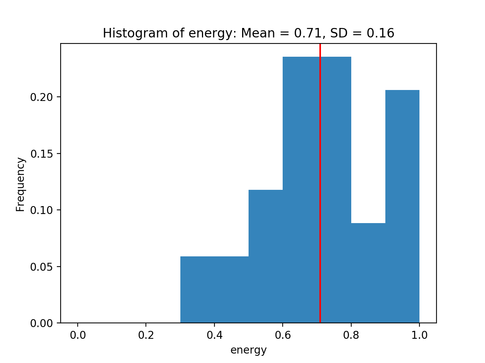
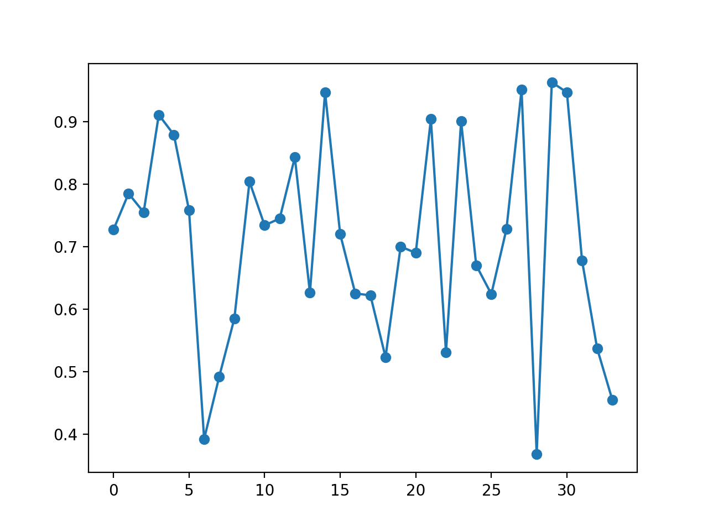
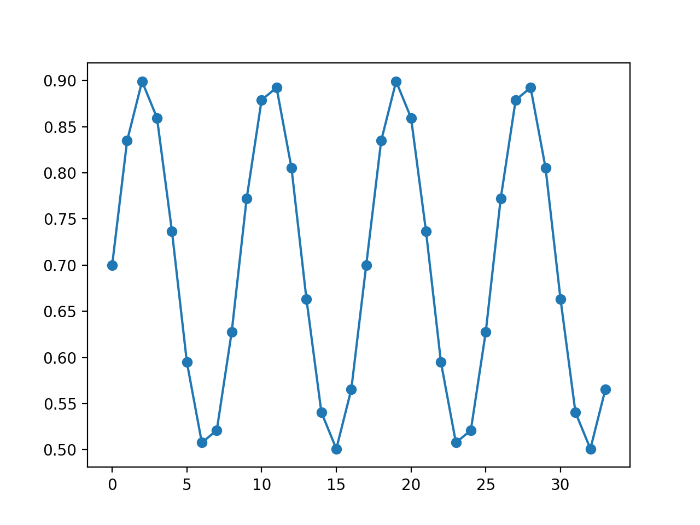
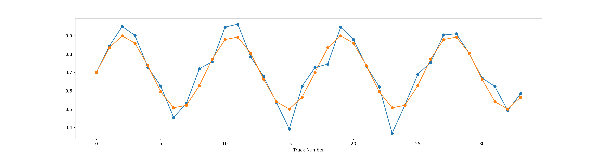

# playlist-builder

A helpful tool to aid in reordering your Spotify playlists!

## What is playlist-builder?

Have you ever had to put together a playlist for a party? Or maybe for getting amped up? Did you ever feel like the shuffle from Spotify let you down? That you had to skip one too many songs because it didn't fit the mood you wanted at that very moment?

That's where playlist-builder comes in.

Spotify has all sorts of calculated metrics for songs, including 'energy', 'danceability', or 'valence'. Using these metrics, playlist-builder lets you take a playlist, and define a custom function for the flow of your playlist. No more relying on Spotify to shuffle and randomly pick what you want- playlist-builder will reorder the songs in your playlist to best fit the given function.

Essentially, you can define the flow of your night.

## How to use it

In order to use playlist-builder you need to obtain a Spotify Developer Client ID and Secret (look at Spotipy's docs for help with this if you need it).

Once you obtain a client secret and client ID you can then begin fitting your playlist to a generated function.

## Fitting Functions

demographics.py includes plotting functions that let you understand the demographics of the playlist that you are working with. For example, here is a generated histogram for the energy levels within a playlist:

  

You can also see how the energy level of your playlist changes over time if you were to play it from start to finish:

  

We can then generate functions to then "fit" the playlist to. For instance, here is an example of a generated sin curve:

  

We can then reorder the playlist to fit this function as such:

At this point we can then send the playlist back to Spotify to reorder your playlist.

Note, this will remove all of your metadata associated with the songs (i.e. date added to playlist). If this is important to you, push the new changes to a different playlist.

